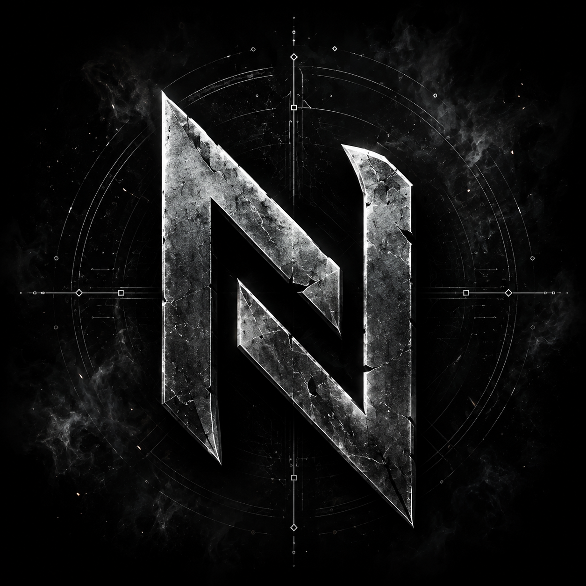

# Nullforge Simple Inviter

A free, open-source, single-account VRChat group auto-inviter. Log in to
one VRChat account, point it at one group, and it watches your local
VRChat log and invites people who join — respecting VRChat's own rate
limits by pausing and waiting, never routing around them.

No server, no license keys, no account required beyond your own VRChat
login. Everything runs locally on your machine.



## Download

Grab the latest pre-built Windows `.exe` from the [Releases](../../releases)
page — no Python install needed. Or run from source (see below) if you'd
rather see exactly what it's doing or you're on a different OS.

## Features

- Watches your VRChat log locally and detects when people join your instance
- Auto-invites to your group, or manually select people from the list yourself
- Respects VRChat's real rate limits — pauses on cooldown, stops on daily cap, never bypasses them
- Keeps a local history so it never double-invites or spams "already invited" errors
- Save/load your detected list as a file
- Login via username+password (with 2FA support) or paste an existing auth cookie directly
- Everything stored locally, encrypted — nothing sent anywhere except directly to VRChat's own API

## Running from source

```
pip install -r requirements.txt
python nullforge_simple_inviter.py
```

First run:
1. **Log Folder…** — auto-detects VRChat's default log location; only needed if it's installed somewhere non-standard.
2. **Set Group…** — enter your group ID (`grp_...`).
3. **Log In…** — VRChat username/password (handles 2FA), or paste an existing auth cookie directly.
4. Toggle **Auto-invite on join** to invite automatically, or leave it off and use **Invite Selected** manually.

**Auto-invite on join** vs **18+ verified worlds mode** — both use the same
join detection; the difference is the delay and the assumption behind it.
"Auto-invite" fires immediately (or after whatever delay you set), for
regular groups. "18+ mode" assumes the instance is already gated by
VRChat's own age verification system, and the delay (default 40s) is a
buffer against edge cases — not a verification step itself. This tool does
not perform age verification; it relies entirely on VRChat's own system
having already gated the instance.

## Rate-limit behavior

- Tracks its own daily invite count (resets every 24h)
- On a cooldown-type response, pauses ~30s before retrying
- On hitting VRChat's real daily cap, stops entirely and re-checks after ~35 min
- Never coordinates multiple accounts to get around a single account's limit — this is intentionally a single-account tool

## Building the .exe yourself

```
pyinstaller --onefile --windowed --name "NullforgeSimpleInviter" --icon=assets/nullforge_icon.ico --version-file=version_info.txt --add-data "ui;ui" nullforge_simple_inviter.py
```

Or push a version tag (`git tag v1.0.0 && git push origin v1.0.0`) and
GitHub Actions will build it for you automatically — see
`.github/workflows/build.yml`. Useful if you don't have a Windows machine
handy; GitHub's runners do the build and attach the exe to a Release.

**Note on pywebview + Windows**: uses the system's WebView2 runtime, which
comes pre-installed on most modern Windows 10/11 machines. If missing,
pywebview prompts to install it automatically.

## Known gaps / contributions welcome

- **Join-detection regex** (`JOIN_PATTERN`) is based on VRChat's
  commonly-referenced but not officially documented log format. If joins
  aren't detecting on your setup, check the Activity log for
  `[unmatched join line]` entries — that's the raw line VRChat actually
  wrote, useful for fixing the pattern. PRs welcome.
- Login/2FA flow is based on the same commonly-referenced pattern — same
  caveat applies.
- Unsigned builds may get flagged by Windows Smart App Control / SmartScreen
  until the release has enough reputation, or is code-signed. Contributions
  toward code-signing the release builds are welcome.

## A note on responsible use

This tool automates VRChat group invites from a single account and
deliberately does not include features to coordinate multiple accounts or
otherwise work around VRChat's per-account limits. Please respect VRChat's
Terms of Service when using it, and don't use it to invite people who
haven't consented to joining your group's instances.

## Tips

Your support helps maintain and improve Nullforge Simple Inviter. If you find this tool useful, please consider tipping:

- [Ko-fi](https://ko-fi.com/saintnyklas)
- [Buy Me a Coffee](https://buymeacoffee.com/saintnyklas)
- Cash App: [$RajinPatel](https://cash.app/$RajinPatel)

## License

MIT — see [LICENSE](LICENSE). Free to use, modify, and redistribute.
